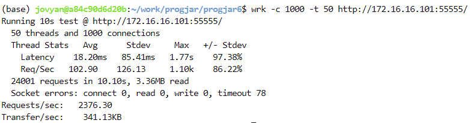

# asynchronus-vs-thread

Tugas 5 Pemrograman Jaringan Kelas C
| Nama | NRP |
| ------------- | ------------- |
| Duevano Fairuz Pandya | 5025211052 |

Instruksi Tugas 5 <a href="https://docs.google.com/document/d/1a-sERbeOrIqJkupPDOagUTzhuU-mFH8Nu_QUPmwgezM/edit">Disini</a>

### Cara menjalankan pengetesan

1. Pastikan sudah menginstal `wrk` dengan cara melakukan:

```
sudo apt update
sudo apt install wrk
```

2. Jalankan worker server dengan cara:

```bash
# worker async
bash runserver.sh
```

```bash
# worker process thread
bash runserverprocess.sh
```

3. Jalankan load balancer di terminal lain (dalam mesin yang sama) dengan cara:

```bash
# untuk load balancer asynchronus
python3 lb_async.py
```

```bash
# untuk load balancer process
python3 lb_process.py
```

**Jadi semisal untuk melakukan pengetesan asynchronus jalankan sepasang eksekusi milik asynchronus saja, begitu pula sebaliknya**<br>

4. Buka terminal lain pada mesin yang sama atau mesin yang berbeda (mesin yang dimaksud menggunakan docker <a href="https://github.com/rm77/progjar">disini</a>)
5. Jalankan command `wrk -c 1000 -t [konkurensi/thread] http://[ip-server]:[port]/`, dimana untuk lb_async menggunaakn port 55555, sedangkan lb_process 44444
   contoh:

```bash
# untuk mengetes lb_async konkurensi 10
wrk -c 1000 -t 10 http://172.16.16.101:55555/
```

```bash
# untuk mengetes lb_process konkurensi 10
wrk -c 1000 -t 10 http://172.16.16.101.44444/
```

## A. Hasil pengetesan asynchronus dengan load balancer

- konkurensi 10<br>
  
- konkurensi 50<br>
  
- konkurensi 100<br>
  
- konkurensi 150<br>
  
- konkurensi 200<br>
  

## B. Hasil pengetesan server process pool http dengan load balancer

- konkurensi 10<br>
  
- konkurensi 50<br>
  
- konkurensi 100<br>
  
- konkurensi 150<br>
  
- konkurensi 200<br>
  
